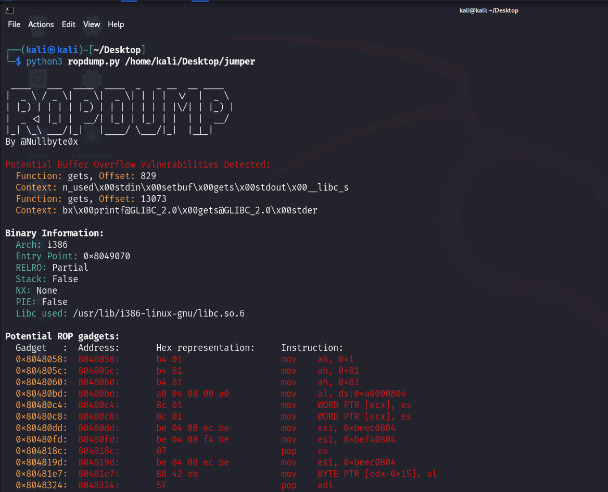
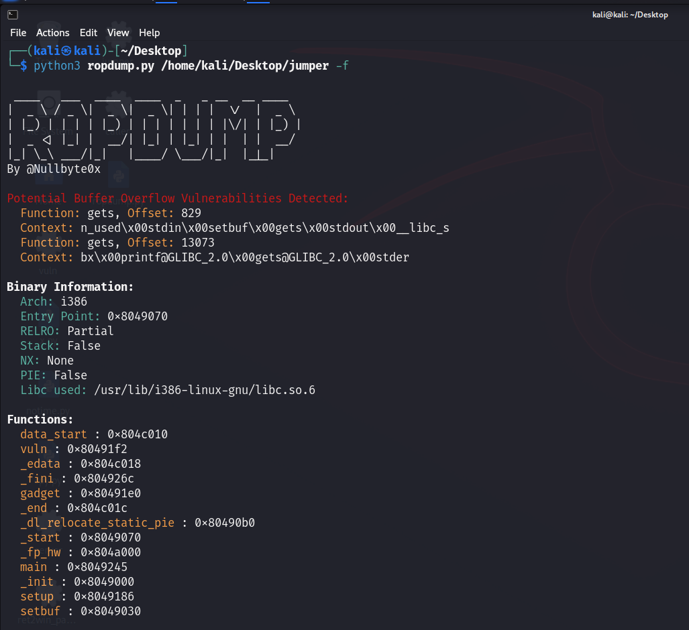
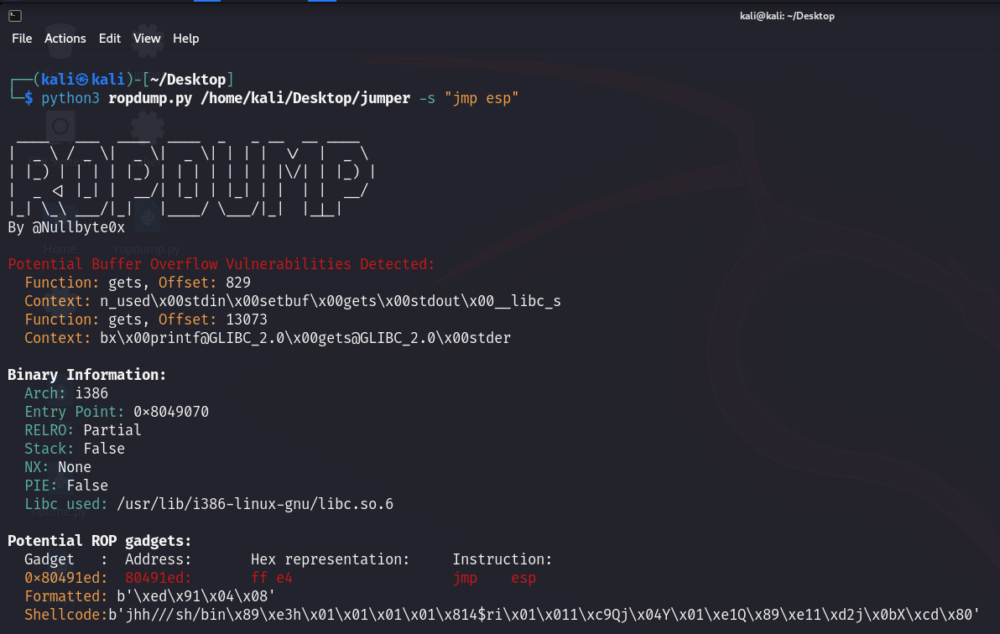

# ROPDump

ROPDump is a tool for analyzing binary executables to identify potential Return-Oriented Programming (ROP) gadgets, as well as detecting potential buffer overflow and memory leak vulnerabilities.

## Features

- Identifies potential ROP gadgets in binary executables.
- Detects potential buffer overflow vulnerabilities by analyzing vulnerable functions.
- Identifies potential memory leak vulnerabilities by analyzing memory allocation functions.
- Generates exploit templates to make the exploit process faster
- Can print function names and addresses for further analysis.
- Supports searching for specific instruction patterns.

## Usage

- `<binary>`: Path to the binary file for analysis.
- `-s, --search SEARCH`: Optional. Search for specific instruction patterns.
- `-f, --functions`: Optional. Print function names and addresses.

## Examples

- Analyze a binary without searching for specific instructions:

python3 ropdump.py /path/to/binary

- Analyze a binary and search for specific instructions:

python3 ropdump.py /path/to/binary -s "pop eax"

- Analyze a binary and print function names and addresses:

python3 ropdump.py /path/to/binary -f

